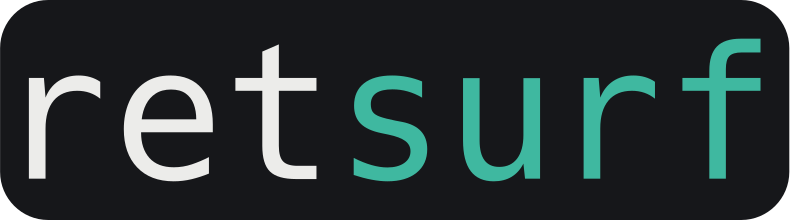
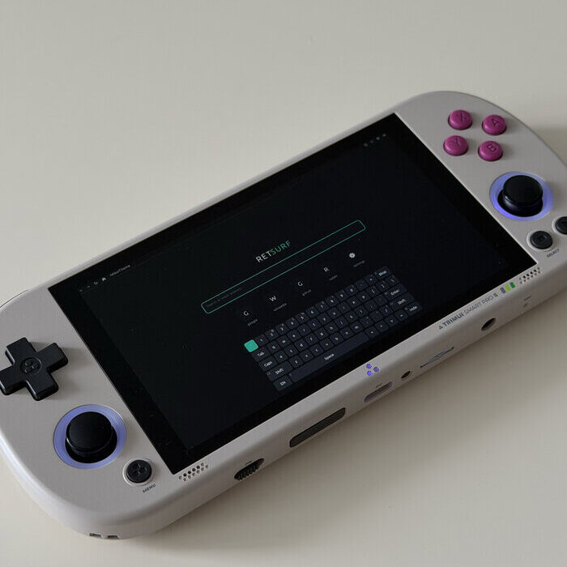
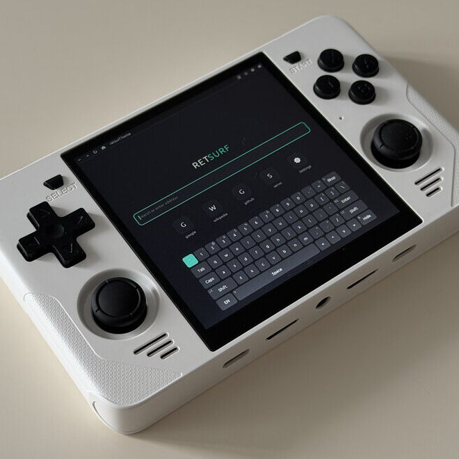
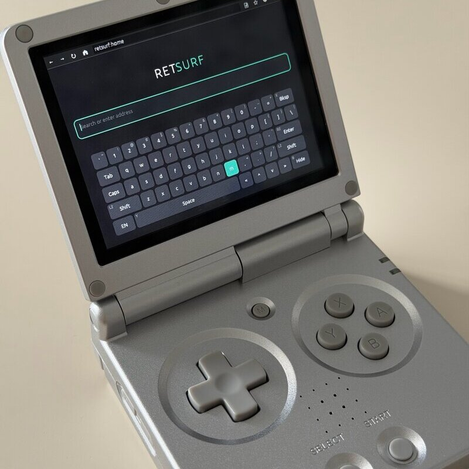

<h1 align="center">
  
</h1>

<p align="center">A lightweight, gamepad-native web browser.</p>

<div align="center">
  <a href="https://github.com/mxmgorin/retsurf/actions/workflows/build-linux-arm.yml"></a>
  <a href="https://github.com/mxmgorin/retsurf/actions/workflows/build-windows.yml"></a>
  <a href="https://github.com/mxmgorin/retsurf/actions/workflows/build-macos.yml"></a>
  <a href="https://github.com/mxmgorin/retsurf/actions/workflows/build-linux.yml"></a>
  <a href="https://github.com/mxmgorin/retsurf/actions/workflows/build-android.yml"></a>
  <a href="https://deps.rs/repo/github/mxmgorin/retsurf"></a>
</div>

retsurf (retro+surfing) is an experimental web browser written in **Rust**, using [**Servo**](https://github.com/servo/servo) as the rendering engine, **SDL2** for windowing and input, and **egui** for the UI.

It is designed to run **without X11 or Wayland** — rendering through **OpenGL ES** on bare KMS/DRM — with **gamepad support**, targeting PortMaster-compatible Linux handhelds (**Knulli, muOS, ROCKNIX**), as well as regular desktops. It also runs on **Android** (touch + system keyboard).

> 🛠️ **Work in progress.** Early development — experimental and bugs are expected.

## Gallery

<table>
  <tr>
    <td align="center"></td>
    <td align="center"></td>
    <td align="center"></td>
  </tr>
</table>

## Why?

Handheld Linux distros (Knulli, muOS, ROCKNIX) lack a usable browser. Lightweight options can't render modern JS-heavy sites; desktop browsers assume a windowing setup and pointer input these devices don't have. `retsurf` targets that gap with a modern rendering engine, native gamepad navigation, and no compositor dependency.

## Features

- **Gamepad-native navigation** — a virtual cursor (stick / D-pad), Vimium-style link hints hop between clickable elements, and an on-screen keyboard (QWERTY + ЙЦУКЕН). Every gesture is rebindable in-app or in `bindings.toml`, with a D-pad scroll mode for stickless devices — see the [controls reference](docs/CONFIGURATION.md#bindings-bindingstoml).
- **Tabs, bookmarks, history, downloads** — a full-screen menu. File links download in the background with progress, cancel, and a ⬇ toolbar chip, saving to the system download folder or a configured path.
- **Real page zoom** — reflows the layout (not a magnifier) along Firefox's 50–300% ladder, per tab; set a default in the config so the whole web fits a small screen.
- **Reader mode** — strips a page to its article with Mozilla's [Readability](https://github.com/mozilla/readability) and a dark, narrow-column layout. Runs in place, so it works on logged-in and dynamic pages.
- **Ad & tracker blocking** — network-level via [Brave's adblock-rust](https://github.com/brave/adblock-rust) (EasyList + EasyPrivacy). Lists are fetched, compiled, and cached locally, so warm starts are instant and work offline. Configurable, or off.
- **Native start page** — a search/URL field over a speed-dial grid of pins (`retsurf:home`), drawn in egui and fully controller-navigable like the other overlays.
- **Modern rendering** — real web rendering via **Servo** (WebRender) on **OpenGL ES 3.x**, no X11/Wayland required (bare KMS/DRM). Single GL context, zero CPU readback — Servo draws straight into the on-screen context.

## Building & running

You need Servo's build dependencies. On Debian/Ubuntu:

```sh
sudo apt-get install -y build-essential clang cmake curl git gperf pkg-config python3 \
  libssl-dev libdbus-1-dev libfreetype6-dev libglib2.0-dev \
  libgl1-mesa-dev libegl1-mesa-dev libgles2-mesa-dev \
  libharfbuzz-dev liblzma-dev libudev-dev libunwind-dev libsdl2-dev
```

Then:

```sh
cargo run
```

On a Wayland desktop, retsurf auto-selects SDL's Wayland driver and a GLES context.

**Environment variables** override paths (config, data dir, downloads) and control
logging at launch — see [Configuration & bindings](docs/CONFIGURATION.md#environment-variables).

### Android

retsurf builds an APK: SDL2 loads the Rust code as a cdylib and the existing
GLES/FBO render path carries over, with touch input and the system soft keyboard.
With the Android SDK/NDK installed, one command cross-compiles and assembles it:

```sh
rustup target add aarch64-linux-android
cargo install cargo-ndk --locked
./android/scripts/build.sh release   # android/app/build/outputs/apk/release/app-release.apk
adb install -r android/app/build/outputs/apk/release/app-release.apk
```

Use a **release** build on device (a debug cdylib doesn't drive the initial page
load). See [Android notes](docs/ANDROID_PORT.md) for the toolchain, how the pieces
fit, and current status.

## Configuration

Settings live in `config.toml` and gamepad/keyboard mappings in `bindings.toml`,
both in the user data dir (`SDL_GetPrefPath`, e.g.
`~/.local/share/mxmgorin/retsurf/` on Linux). Templates with the defaults are
written on first run, and most settings are editable in-app from the ⚙ overlay.

See **[Configuration & bindings](docs/CONFIGURATION.md)** for every option — the
annotated `config.toml` (browser, display, OSK, performance/memory profile,
history, downloads, ad blocker, input) and the full `bindings.toml` reference.

## References

- [Configuration & bindings](docs/CONFIGURATION.md) — every `config.toml` / `bindings.toml` option
- [Handheld notes](docs/HANDHELD_PORT.md) — how it works, architecture, porting status
- [Android notes](docs/ANDROID_PORT.md) — build/packaging, storage, touch, lifecycle, status
- [The Servo Book](https://book.servo.org/title-page.html)
