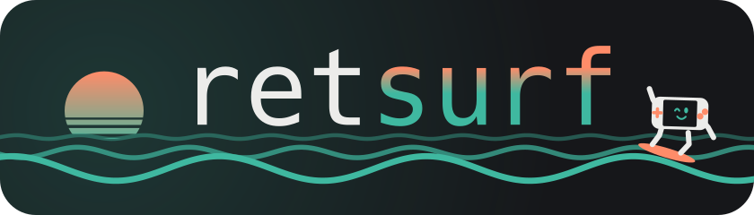
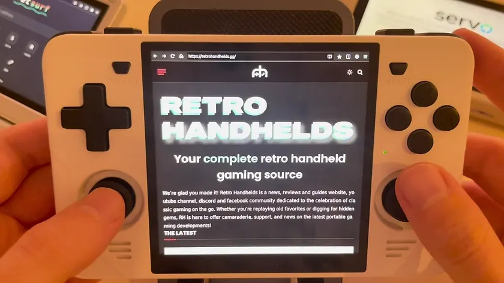
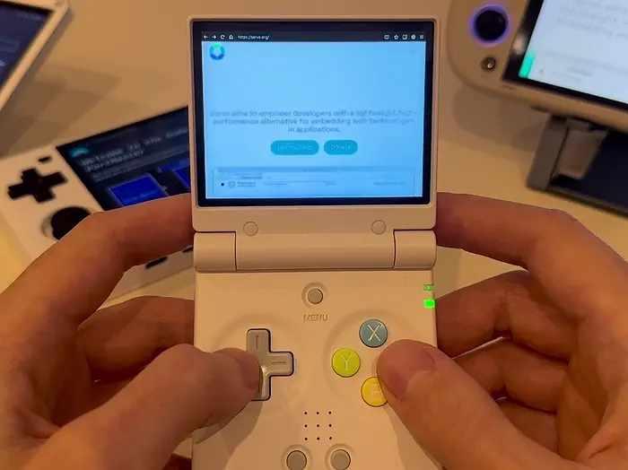

  

  
  
  <!-- One CI badge, not six: the Linux workflow is the only one a pull request runs, and it carries the tests and clippy. -->
  

retsurf (**ret**ro + **surf**ing) is a web browser powered by [Servo](https://servo.org/) for web rendering and SDL2 for windowing and input. It doesn't require **X11, Wayland, or a GPU**, and provides **gamepad-first navigation**. The goal is to bring a fully featured web experience to devices that traditional browsers weren't designed to run on.

It runs on [PortMaster-compatible](https://portmaster.games/supported-devices.html) handhelds, Miyoo Mini Flip and Plus running [OnionOS](https://onionui.github.io/) and [Allium](https://github.com/goweiwen/Allium), as well as regular desktops and Android. It renders on the device's OpenGL ES driver, or on the CPU through the `software` build where there is no GPU, as on the Miyoo Mini.

> **Work in progress.** Early development — expect bugs.

## Demos

| Powkiddy RGB30 | Miyoo Mini Flip |
|:---:|:---:|
|  |  |
| OpenGL ES | `software` build, no GPU |

## Screenshots

| Start page | Browsing | Link hints | Keyboard |
|:---:|:---:|:---:|:---:|
|  |  |  |  |

| Tabs | Downloads | Reader mode | Settings |
|:---:|:---:|:---:|:---:|
|  |  |  |  |

## Why?

Handheld Linux devices lack good browser options. Lightweight browsers struggle with modern, JS-heavy sites, while desktop browsers rely on windowing systems, mouse and keyboard input, and more capable hardware. retsurf is an attempt to build a web browser for devices like this, combining a modern web engine with gamepad-first controls and direct rendering that requires no compositor.

## Features

- **Gamepad-first navigation** 
  Virtual cursor with stick/D-pad control, Vimium-style link hints, and an on-screen keyboard (QWERTY + ЙЦУКЕН).

- **Customizable controls** 
  Every action is rebindable in-app or in [`bindings.toml`](docs/CONFIGURATION.md#bindings-bindingstoml): with support for taps, holds and button chords.

- **Tabs, bookmarks, history, and downloads** 
  Everything lives in one full-screen menu. Downloads run in the background with progress and cancellation, with a toolbar chip for active downloads.

- **Real page zoom** 
  Reflows the layout rather than magnifying it, following Firefox's 50–300% zoom ladder; zoom is per-tab.

- **Reader mode** 
  Strips pages down to their articles using Mozilla's [Readability](https://github.com/mozilla/readability). Runs in place, so it also works with logged-in and dynamically rendered pages.

- **Dark web pages** 
  Uses sites' own dark themes through `prefers-color-scheme`, or forces a dark appearance by inverting pages that don't provide one.

- **Ad & tracker blocking** 
  Network-level blocking powered by Brave's [`adblock-rust`](https://github.com/brave/adblock-rust), using EasyList and EasyPrivacy. Filters are compiled and cached locally for instant warm starts and offline blocking.

- **Native start page** 
  A search/URL field over a speed-dial grid of pins (`retsurf:home`), fully controller-navigable like every other overlay.

- **In-app updates** 
  Checks GitHub for updates, displays release notes, and installs updates in place on PortMaster handhelds and Linux desktops. Supports stable, beta, and dev channels.

- **Web Audio** 
  Custom servo-media backend over SDL2: oscillators, gain, filters, panners, buffers, and `decodeAudioData` for MP3, WAV, FLAC, Ogg/Vorbis, and AAC/M4A, with resampling to the context rate.

- **Audio & video elements** 
  `<audio>` streams MP3, WAV, FLAC, Ogg/Vorbis, and AAC/M4A as they download, with HTTP Range seeking. `<video>` decodes H.264-in-MP4 in software through OpenH264 and syncs to the audio track. No MSE, so this supports direct files and embeds rather than streaming sites.

- **Hardware-accelerated rendering** 
  Servo's WebRender uses OpenGL ES 3.x with a single GL context and zero CPU readback, drawing directly into the on-screen framebuffer.

- **Software rendering** 
  The `software` build replaces both renderers with CPU-based ones: SWGL rasterizes web pages, while SDL's 2D renderer draws the browser UI.

## Install

Download from [Releases](https://github.com/mxmgorin/retsurf/releases), then:

| Device                | Package                                                 | Where it goes                     |
| --------------------- | ------------------------------------------------------- | --------------------------------- |
| PortMaster handhelds  | `retsurf-portmaster.zip`                                | ports folder, e.g. `/roms/ports/` |
| Miyoo Mini on OnionOS | `retsurf-onionos.zip`                                   | `App/Retsurf/` on the SD card     |
| Miyoo Mini on Allium  | `retsurf-allium.zip`                                    | `Apps/Retsurf.pak/` on the SD card |
| Android               | `retsurf-android-arm64.apk`                             | sideload it                       |
| Linux                 | `retsurf-linux-x86_64.zip`, `retsurf-linux-aarch64.zip` | unpack and run                    |
| Windows               | `retsurf-windows-x86_64.zip`                            | unpack and run                    |
| macOS                 | `retsurf-macos-aarch64.dmg`                             | open it and run `Retsurf.app`     |

On both Miyoo firmwares the app shows up in the Apps menu, and **MENU quits** it.

## Building

`cargo run`, once Servo's build dependencies are installed. See **[Building from
source](docs/BUILDING.md)** for the prerequisites on each OS, the Cargo features,
Android, and the handheld cross-builds.

## Configuration

`config.toml` (settings) and `bindings.toml` (gamepad/keyboard mappings) live in the
user data dir (`SDL_GetPrefPath`, e.g. `~/.local/share/mxmgorin/retsurf/` on Linux).
Templates with the defaults are written on first run. See **[Configuration & bindings](docs/CONFIGURATION.md)** for every option and the
full bindings reference.

## Support

If you find the project useful, here is how you can help:

- **Tell other people about it.** Sharing the project helps it reach more users.
- **Report bugs and request features** in [Issues](https://github.com/mxmgorin/retsurf/issues). If something is broken or you have an idea, let me know.
- **Star the repo.** It helps the project get noticed and keeps me motivated.

## Credits

- Web rendering by [Servo](https://servo.org)
- [SDL2](https://libsdl.org) through [rust-sdl2](https://github.com/Rust-SDL2/rust-sdl2)
  for window, input and audio
- [egui](https://github.com/emilk/egui) draws every overlay, with icons from
  [Phosphor](https://phosphoricons.com/)
- Blocking by Brave's [adblock-rust](https://github.com/brave/adblock-rust), over
  [EasyList](https://easylist.to/) and EasyPrivacy
- Reader mode by Mozilla's [Readability](https://github.com/mozilla/readability)
- Media by [Symphonia](https://github.com/pdeljanov/Symphonia) and
  [openh264](https://github.com/ralfbiedert/openh264-rs) over Cisco's codec
- TLS by [rustls](https://github.com/rustls/rustls)
- SDL2 for the Miyoo Mini by [Steward Fu](https://github.com/steward-fu/sdl2)
