<h1 align="center">
  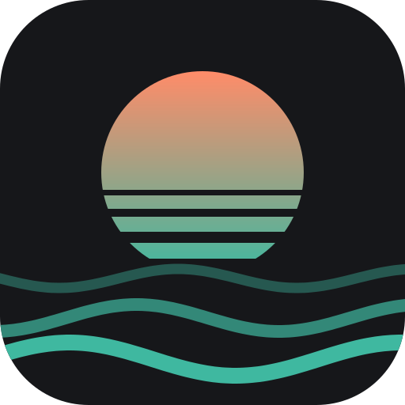
</h1>

<p align="center">A gamepad-native web browser for unconventional devices.</p>

<div align="center">
  <a href="https://github.com/mxmgorin/retsurf/releases/latest"></a>
  <a href="https://github.com/mxmgorin/retsurf/actions/workflows/build-linux-arm.yml"></a>
  <a href="https://github.com/mxmgorin/retsurf/actions/workflows/build-linux.yml"></a>
  <!-- Inline glyph: simple-icons carries no Microsoft icon, and shields drops logo=windows without a word. -->
  <a href="https://github.com/mxmgorin/retsurf/actions/workflows/build-windows.yml"></a>
  <a href="https://github.com/mxmgorin/retsurf/actions/workflows/build-macos.yml"></a>
  <a href="https://github.com/mxmgorin/retsurf/actions/workflows/build-android.yml"></a>
  <a href="https://deps.rs/repo/github/mxmgorin/retsurf"></a>
</div>

retsurf (**ret**ro + **surf**ing) is an experimental web browser written in Rust. The goal is to bring a fully featured web experience to devices that traditional browsers weren't designed to run on. Powered by [Servo](https://servo.org/) for web rendering, SDL2 for windowing and input, retsurf runs **without X11, Wayland, or even a GPU**,  and provides **gamepad-first navigation**.

It supports [PortMaster-compatible](https://portmaster.games/supported-devices.html) handhelds, Miyoo Mini Flip and Plus running [OnionOS](https://onionui.github.io/) and [Allium](https://github.com/goweiwen/Allium), as well as regular desktops and Android. Where there is no compositor, retsurf renders straight to KMSDRM through OpenGL ES; on GPU-less devices such as the Miyoo Mini, the `software` build rasterizes both web pages and the UI on the CPU.

> **Work in progress.** Early development — expect bugs.

## Gallery

<table>
  <tr>
    <td align="center">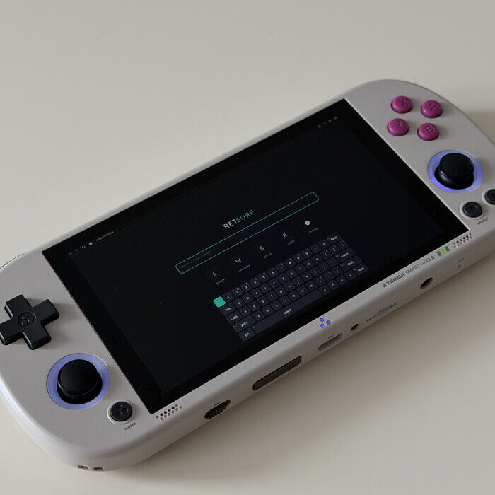</td>
    <td align="center">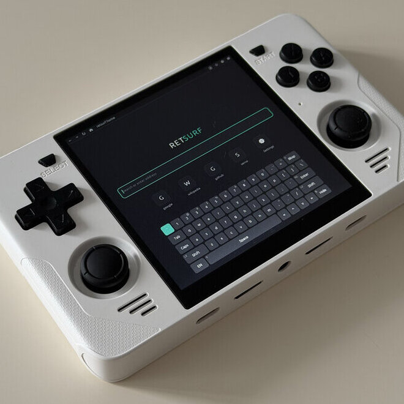</td>
    <td align="center">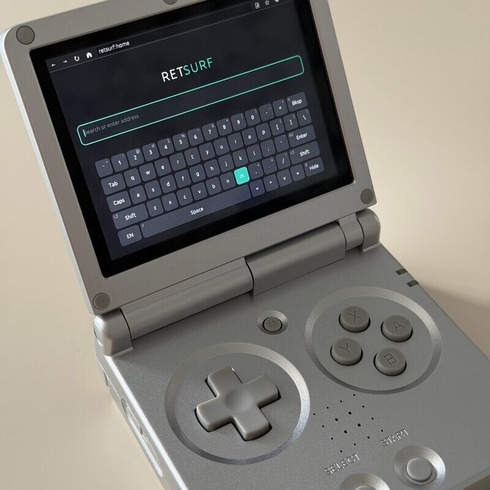</td>
  </tr>
</table>

| Start page | Browsing | Link hints | Keyboard |
|:---:|:---:|:---:|:---:|
| 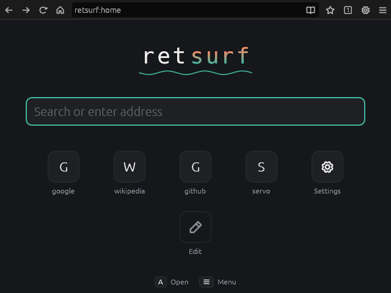 | 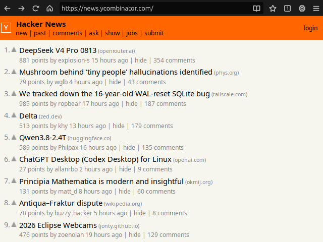 | 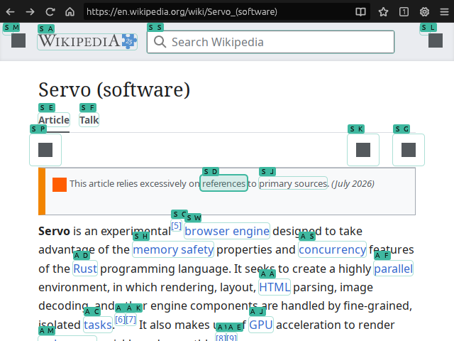 | 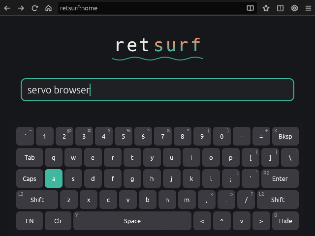 |

| Tabs | Downloads | Reader mode | Settings |
|:---:|:---:|:---:|:---:|
| 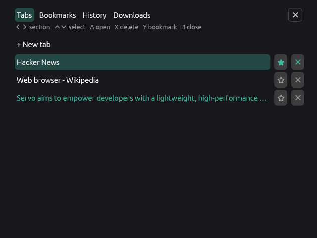 | 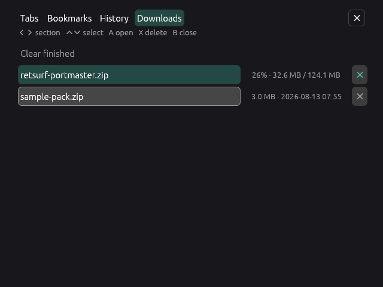 | 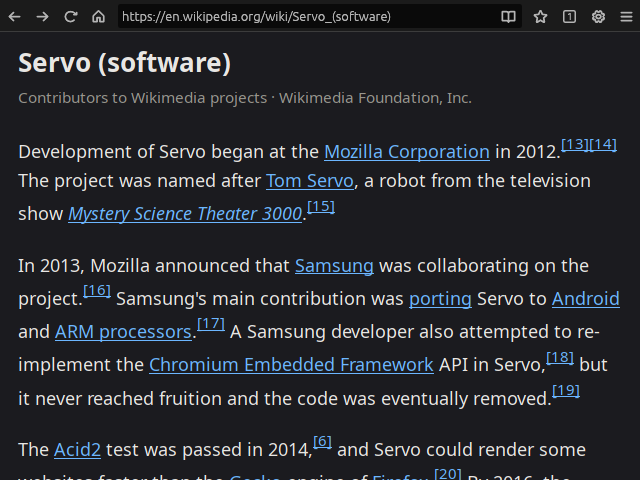 | 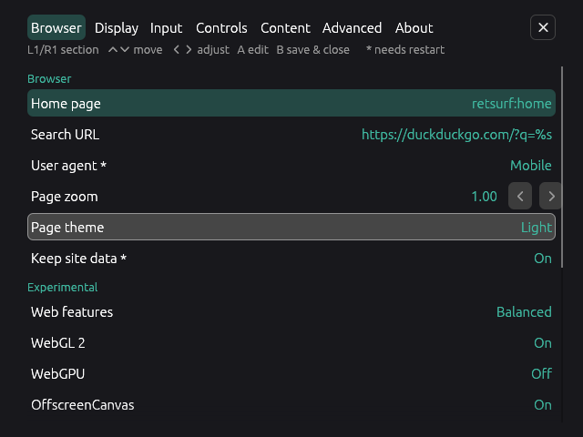 |

## Why?

Handheld Linux devices have no good browser options. Lightweight browsers often struggle with modern, JS-heavy sites, while desktop browsers depend on a windowing system, mouse and keyboard, and hardware that these devices don't have. retsurf is an attempt to fill that gap: a modern web engine, gamepad-first controls, and direct rendering without a compositor.

## Features

- **Gamepad-native navigation**<br>
  Virtual cursor with stick/D-pad control, Vimium-style link hints, and an on-screen keyboard (QWERTY + ЙЦУКЕН).

- **Customizable controls**<br>
  Every action is rebindable in-app or in [`bindings.toml`](docs/CONFIGURATION.md#bindings-bindingstoml): with support for taps, holds and button chords.

- **Tabs, bookmarks, history, and downloads**<br>
  Everything lives in one full-screen menu. Downloads run in the background with progress and cancellation, with a toolbar chip for active downloads.

- **Real page zoom**<br>
  Reflows the layout rather than magnifying it, following Firefox's 50–300% zoom ladder; zoom is per-tab.

- **Reader mode**<br>
  Strips pages down to their articles using Mozilla's [Readability](https://github.com/mozilla/readability). Runs in place, so it also works with logged-in and dynamically rendered pages.

- **Dark web pages**<br>
  Uses sites' own dark themes through `prefers-color-scheme`, or forces a dark appearance by inverting pages that don't provide one.

- **Ad & tracker blocking**<br>
  Network-level blocking powered by Brave's [`adblock-rust`](https://github.com/brave/adblock-rust), using EasyList and EasyPrivacy. Filters are compiled and cached locally, making warm starts instant and allowing blocking to work offline.

- **Native start page**<br>
  A search/URL field over a speed-dial grid of pins (`retsurf:home`), fully controller-navigable like every other overlay.

- **In-app updates**<br>
  Checks GitHub for updates and shows release notes inline. On PortMaster handhelds and Linux desktops, updates can be installed in place; elsewhere, the release page is opened. Supports stable, beta, and dev channels.

- **Web Audio**<br>
  Custom Servo media backend with SDL2 output. Supports oscillators, gain, filters, panners, scripted buffers, and `decodeAudioData` for MP3, WAV, FLAC, Ogg/Vorbis, and AAC/M4A, with resampling to the context rate.

- **Hardware-accelerated rendering**<br>
  Servo's WebRender uses OpenGL ES 3.x with a single GL context and zero CPU readback, drawing directly into the on-screen framebuffer.

- **Software rendering**<br>
  The `software` build replaces both renderers with CPU-based ones: SWGL rasterizes web pages, while SDL's 2D renderer draws the browser UI.

## Install (PortMaster devices)

Download `retsurf-portmaster.zip` from
[Releases](https://github.com/mxmgorin/retsurf/releases) and unpack it into your
ports folder (e.g. `/roms/ports/`).

## Install (Miyoo Mini Plus / Flip)

Download the appropriate zip from
[Releases](https://github.com/mxmgorin/retsurf/releases) and unzip it at the root
of the SD card.

| OS      | Package               | Location            |
| ------- | --------------------- | ------------------- |
| OnionOS | `retsurf-onionos.zip` | `App/Retsurf/`      |
| Allium  | `retsurf-allium.zip`  | `Apps/Retsurf.pak/` |

The app appears in the respective Apps menu and **MENU quits** it on both.

## Install (Android)

Download `retsurf-android-arm64.apk` from
[Releases](https://github.com/mxmgorin/retsurf/releases) and sideload it.

## Install (desktop)

Download the appropriate zip from
[Releases](https://github.com/mxmgorin/retsurf/releases), unpack and run.

| OS      | Package                                                 |
| ------- | ------------------------------------------------------- |
| Linux   | `retsurf-linux-x86_64.zip`, `retsurf-linux-aarch64.zip` |
| Windows | `retsurf-windows-x86_64.zip`                            |
| macOS   | `retsurf-macos-aarch64.dmg`                             |

## Building & running

You need Servo's build dependencies. On Debian/Ubuntu:

```sh
sudo apt-get install -y build-essential clang cmake curl git gperf pkg-config python3 \
  libssl-dev libdbus-1-dev libfreetype6-dev libglib2.0-dev \
  libgl1-mesa-dev libegl1-mesa-dev libgles2-mesa-dev \
  libharfbuzz-dev liblzma-dev libudev-dev libunwind-dev libsdl2-dev
```

Then:

```sh
cargo run
```

### Android

With the Android SDK/NDK installed:

```sh
rustup target add aarch64-linux-android
cargo install cargo-ndk --locked
./android/scripts/build.sh release   # android/app/build/outputs/apk/release/app-release.apk
adb install -r android/app/build/outputs/apk/release/app-release.apk
```

## Configuration

`config.toml` (settings) and `bindings.toml` (gamepad/keyboard mappings) live in the
user data dir (`SDL_GetPrefPath`, e.g. `~/.local/share/mxmgorin/retsurf/` on Linux).
Templates with the defaults are written on first run. See **[Configuration & bindings](docs/CONFIGURATION.md)** for every option and the
full bindings reference.

## Credits

- Web rendering by [Servo](https://servo.org)
- [SDL2](https://libsdl.org) through [rust-sdl2](https://github.com/Rust-SDL2/rust-sdl2)
  for window, input and audio
- [egui](https://github.com/emilk/egui) draws every overlay, with icons from
  [Phosphor](https://phosphoricons.com/)
- Blocking by Brave's [adblock-rust](https://github.com/brave/adblock-rust), over
  [EasyList](https://easylist.to/) and EasyPrivacy
- Reader mode by Mozilla's [Readability](https://github.com/mozilla/readability)
- Media by [Symphonia](https://github.com/pdeljanov/Symphonia) and
  [openh264](https://github.com/ralfbiedert/openh264-rs) over Cisco's codec
- TLS by [rustls](https://github.com/rustls/rustls)
- SDL2 for the Miyoo Mini by [Steward Fu](https://github.com/steward-fu/sdl2)
