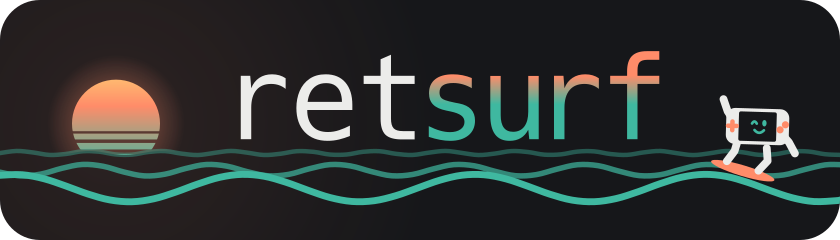
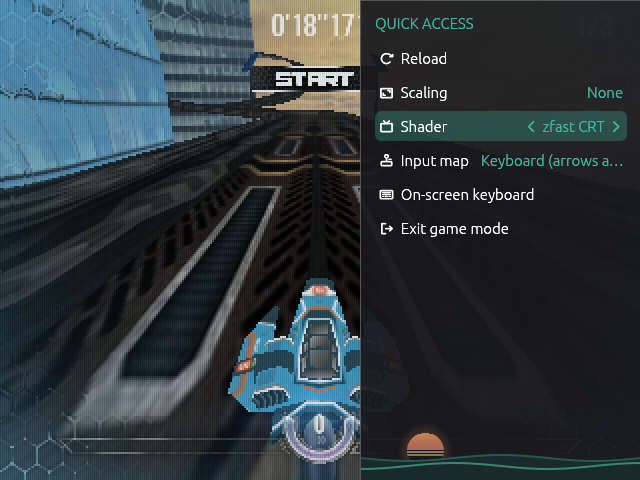
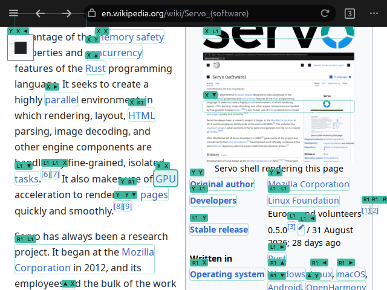
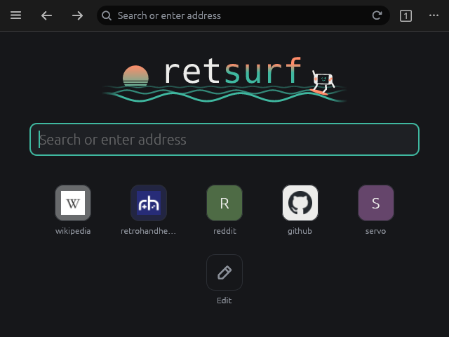
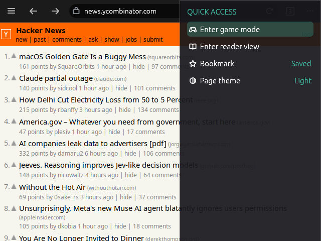

  

  
  
  
  <!-- The check workflow, not a platform build: it is the one a push and a pull request run, and it carries the tests and clippy. -->
  

  <a href="https://retsurf.app/">Website</a> &middot;
  <a href="#install">Install</a> &middot;
  <a href="docs/CONFIGURATION.md">Docs</a> &middot;
  <a href="https://github.com/mxmgorin/retsurf/discussions">Discussions</a>

retsurf is a web browser written in Rust and built with [Servo](https://servo.org/) and [SDL2](https://www.libsdl.org/). It aims to provide a full-featured web experience while staying lightweight and portable. It targets handheld devices while also working on Android and desktops. It has gamepad- and keyboard-friendly controls for browsing and gaming-specific features like remappable input.

**[Install](#install)** on a PortMaster handheld, a Miyoo Mini, Android, Linux, Windows, or macOS.

> **Work in progress.** Early development — expect bugs.

## Screenshots

<table>
  <tr>
    <td width="50%"></td>
    <td width="50%"></td>
  </tr>
  <tr>
    <td width="50%"></td>
    <td width="50%"></td>
  </tr>
</table>

More screenshots and device photos are on the [website](https://retsurf.app/).

## Features

- **Gamepad-first navigation** 
  The browser is fully navigable with a gamepad or keyboard, with a virtual cursor, Vimium-style link hints, and an on-screen keyboard as a grid or a wheel.

- **Customizable browser controls** 
  Every browser action can be rebound in-app, with support for tap, hold, and chord.

- **Game mode** 
  Hides the browser chrome and routes input to the page, with an in-app editor for input maps that turn buttons and sticks into keys, mouse, or raw gamepad input.

- **Game scaling and shaders** 
  Cuts the game out of its page and fits it to the screen, in whole pixels or stretched, then draws it through CRT, LCD, or upscaling shaders. Takes RetroArch's single-pass GLSL shaders, ten built in. See [Shaders](docs/SHADERS.md).

- **Web games** 
  WebGL 2, the Gamepad API, Web Audio, and IndexedDB, plus compatibility shims that let Emscripten exports from itch.io run.

- **Tabs, bookmarks, history, and downloads** 
  Everything lives in one full-screen menu. Downloads run in the background with progress and cancellation and a toolbar chip for active downloads.

- **Real page zoom** 
  Reflows the layout rather than simply magnifying it, with 50–300% zoom steps. Zoom is per-tab.

- **Reader view** 
  Strips pages down to their articles using Mozilla's [Readability](https://github.com/mozilla/readability). Runs in place, so it also works with logged-in and dynamically rendered pages.

- **Dark web pages** 
  Uses sites' own dark themes through `prefers-color-scheme`, or forces a dark appearance by inverting pages that don't provide one.

- **Ad & tracker blocking** 
  Network-level blocking powered by Brave's [`adblock-rust`](https://github.com/brave/adblock-rust), using EasyList and EasyPrivacy.

- **In-app updates** 
  Checks GitHub for updates, displays release notes, and installs updates in place on Linux. Supports stable, beta, and nightly channels.

- **Audio and video** 
  A custom Servo media backend provides audio and video playback. Supports direct media files and embedded players, but not streaming sites that require MSE.

- **No display server required** 
  SDL2 draws through whatever video backend the firmware ships. X11 and Wayland are optional, not required.

- **Hardware or software rendering** 
  A custom Servo rendering backend uses OpenGL ES for GPU-accelerated rendering on supported devices, with a CPU-based software renderer for devices without a GPU.

## Install

Download the latest release for your platform below. All builds are available on
[Releases](https://github.com/mxmgorin/retsurf/releases). Nightly builds from `main` use
the same file names under the rolling
[`nightly`](https://github.com/mxmgorin/retsurf/releases/tag/nightly) tag.

| Device | Package | Where it goes |
| --- | --- | --- |
| [PortMaster handhelds](https://portmaster.games/supported-devices.html) (ArkOS, dArkOS, EmuELEC, Knulli, muOS, ROCKNIX) | [`retsurf-portmaster.zip`](https://github.com/mxmgorin/retsurf/releases/latest/download/retsurf-portmaster.zip) | ports folder, e.g. `/roms/ports/` |
| Miyoo Mini Flip and Plus on [OnionOS](https://onionui.github.io/) | [`retsurf-onionos.zip`](https://github.com/mxmgorin/retsurf/releases/latest/download/retsurf-onionos.zip) | `App/Retsurf/` on the SD card |
| Miyoo Mini Flip and Plus on [Allium](https://github.com/goweiwen/Allium) | [`retsurf-allium.zip`](https://github.com/mxmgorin/retsurf/releases/latest/download/retsurf-allium.zip) | `Apps/Retsurf.pak/` on the SD card |
| Android | [`retsurf-android-arm64.apk`](https://github.com/mxmgorin/retsurf/releases/latest/download/retsurf-android-arm64.apk) | sideload it |
| Linux | [`retsurf-linux-x86_64.zip`](https://github.com/mxmgorin/retsurf/releases/latest/download/retsurf-linux-x86_64.zip), [`retsurf-linux-aarch64.zip`](https://github.com/mxmgorin/retsurf/releases/latest/download/retsurf-linux-aarch64.zip) | unpack and run |
| Windows | [`retsurf-windows-x86_64.zip`](https://github.com/mxmgorin/retsurf/releases/latest/download/retsurf-windows-x86_64.zip) | unpack and run |
| macOS | [`retsurf-macos-aarch64.dmg`](https://github.com/mxmgorin/retsurf/releases/latest/download/retsurf-macos-aarch64.dmg) | open it and run `Retsurf.app` |

On both Miyoo firmwares the app shows up in the Apps menu, and **MENU quits** it.

## Building

`cargo run`, once Servo's build dependencies are installed. See **[Building from
source](docs/BUILDING.md)** for the prerequisites on each OS, the Cargo features,
Android, and the handheld cross-builds.

## Configuration

Files are stored in the user data directory (`SDL_GetPrefPath`, e.g. `~/.local/share/mxmgorin/retsurf/` on Linux).
Templates with the defaults are written on first run. See **[Configuration](docs/CONFIGURATION.md)** for all options, **[Controls](docs/CONTROLS.md)** for bindings and Game Mode input maps, **[Command line](docs/CLI.md)** for arguments and environment variables, and **[Shaders](docs/SHADERS.md)** for Game Mode shaders.

## How to help

If you find the project useful, here is how you can help:

- **Tell other people about it.** Sharing the project helps it reach more users.
- **Report bugs and request features** in [Issues](https://github.com/mxmgorin/retsurf/issues). Feedback is welcome.
- **Star the repo.** It helps the project get noticed and keeps me motivated.
- **[Buy me a coffee](https://ko-fi.com/mxmgorin)** on Ko-fi.

## Credits

- Web rendering by [Servo](https://servo.org)
- [SDL2](https://libsdl.org) through [rust-sdl2](https://github.com/Rust-SDL2/rust-sdl2)
  for window, input and audio
- [egui](https://github.com/emilk/egui) draws every overlay, with icons from
  [Phosphor](https://phosphoricons.com/)
- Blocking by Brave's [adblock-rust](https://github.com/brave/adblock-rust), over
  [EasyList](https://easylist.to/) and EasyPrivacy
- Reader view by Mozilla's [Readability](https://github.com/mozilla/readability)
- Media by [Symphonia](https://github.com/pdeljanov/Symphonia) and
  [openh264](https://github.com/ralfbiedert/openh264-rs) over Cisco's codec
- TLS by [rustls](https://github.com/rustls/rustls)
- SDL2 for the Miyoo Mini by [Steward Fu](https://github.com/steward-fu/sdl2)
- Game Mode shaders from libretro's [glsl-shaders](https://github.com/libretro/glsl-shaders):
  zfast_crt by Greg Hogan, crt-pi by davej, crt-lottes by Timothy Lottes, xBR by Hyllian
  and sharp-bilinear by rsn8887; OmniScale and the LCD shaders from
  [SameBoy](https://github.com/LIJI32/SameBoy) by Lior Halphon
